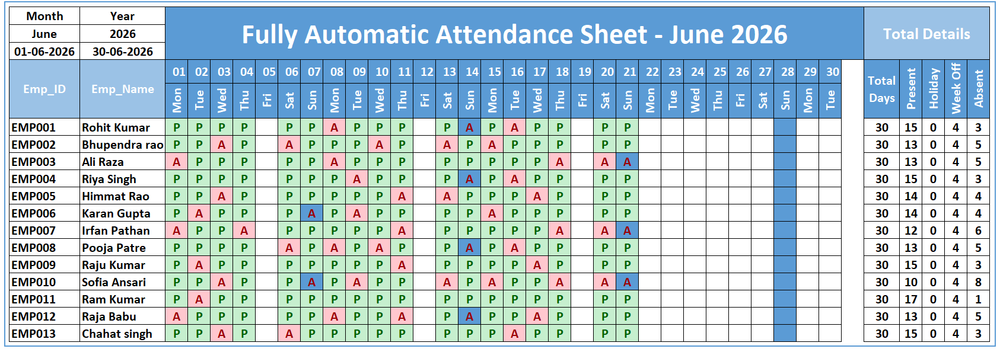
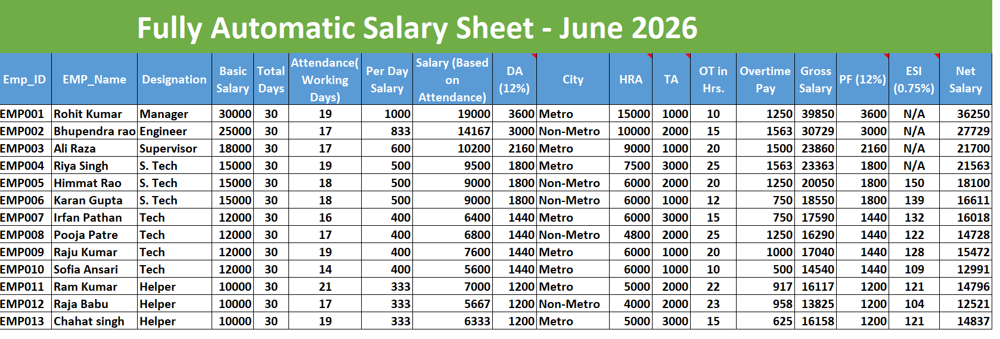
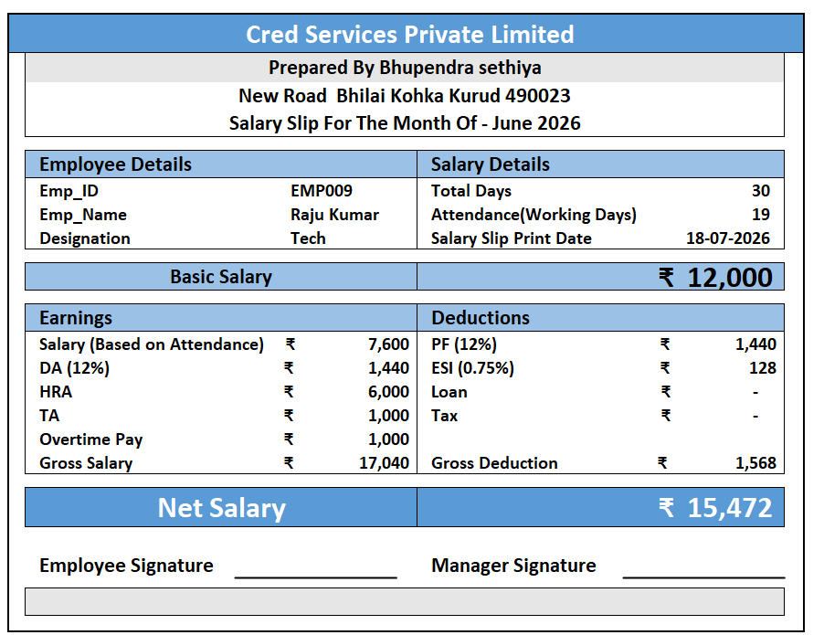

# 💼 Fully Automatic Payroll Management System | Microsoft Excel

## 📌 Project Overview

The **Fully Automatic Payroll Management System** is an Excel-based solution designed to automate employee payroll processing and eliminate repetitive manual tasks. It helps HR and payroll teams efficiently manage employee attendance, salary calculations, deductions, and salary slip generation through an interactive and automated system.

The system updates payroll records dynamically based on attendance data, reducing manual effort and improving payroll accuracy.

---

## 🚀 Business Problem

Many small and medium-sized businesses still process payroll manually using multiple spreadsheets. This often leads to:

- ❌ Time-consuming payroll calculations
- ❌ Human errors in salary processing
- ❌ Inconsistent attendance records
- ❌ Delays in salary slip generation
- ❌ Difficulty managing employee payroll data

---

## 💡 Solution

Developed a **Fully Automatic Payroll Management System** in Microsoft Excel that automates the complete payroll process—from attendance tracking to salary slip generation—helping businesses save time, reduce errors, and streamline payroll operations.

---

## 🎯 Key Features

- 👨‍💼 Employee Management
- 📅 Attendance Management
- 💰 Automatic Salary Calculation
- 🧾 Auto Salary Slip Generation
- 🏖️ Leave & Attendance Tracking
- ⏰ Overtime Calculation
- 💸 Deduction & Bonus Calculation
- 📊 Payroll Dashboard
- 📈 Monthly Payroll Summary
- 🔄 Dynamic Data Updates

---

## ⚙️ Automation Features

- Automatic attendance calculation
- Automatic salary calculation
- Automatic overtime calculation
- Automatic deduction and bonus calculation
- One-click payroll update
- Automatic salary slip generation
- Dynamic dashboard updates

---

## 🛠️ Tools Used

- Microsoft Excel
- Power Query
- Pivot Tables
- Pivot Charts
- Excel Functions
- Data Validation
- Conditional Formatting

---

## 📸 Dashboard Preview

## 📅 Employee Attendance Management

Manage employee attendance with an automated attendance tracking system. Attendance records are dynamically linked to payroll calculations, ensuring accurate salary processing.

---

## 💰 Payroll Calculation

Automatically calculates employee salaries based on attendance, overtime, allowances, and deductions, reducing manual payroll effort and calculation errors.

---

## 🧾 Automatic Salary Slip Generation

Generate professional salary slips automatically for each employee with detailed earnings, deductions, and net salary.

---
## 💼 Business Benefits

- ⏱️ Reduces manual payroll processing time.
- 📉 Minimizes salary calculation errors.
- 📊 Provides real-time payroll insights.
- 📑 Automates salary slip generation.
- 💰 Improves payroll accuracy and efficiency.
- 🚀 Helps HR teams streamline payroll operations.

---

## 🚀 Skills Demonstrated

- Payroll Management
- HR Analytics
- MIS Reporting
- Dashboard Development
- Process Automation
- Data Cleaning
- Data Validation
- Data Visualization
- Business Reporting

---

## 👨‍💻 Author

**Bhupendra Sethiya**

- GitHub: https://github.com/bhupendrasethiya007

---

⭐ If you found this project useful, don't forget to **Star** the repository!
